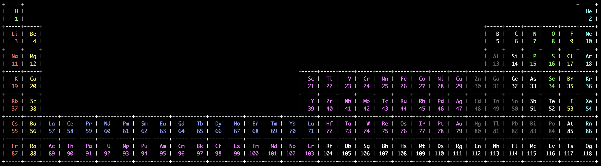

<!--
2020-10-13t22:20:19, Création :
	lava@macta
	/Users/lava/quiz/quiz_tableau_periodique_elements/qtpe_c/README.md
-->

<p align="center">
<h1 align="center">
Quiz sur le tableau périodique des éléments
</h1>

</p>

## Table des matières

* [Bash (console)](#bash-console)
* [C (console)](#c-console)
* [Python (gui)](#python-gui)

## Bash (console)

*Développement arrêté*.

Dans un terminal à `./qtpe_bash/` : `$ ./qtpe`, pour afficher la documentation : `$ ./qtpe -h`.

## C (console)

*Développement en cours*.

Dans un terminal à `./qtpe_c/` : 

- compilation : `$ make`,
- exécution : `$ ./qtpe_c`.

Pour chacun des 118 éléments du tableau périodique, le numéro atomique est affiché et il faut donner le *symbole* et le *nom* de l’élément :

```
16 ? : S Soufre
Oui !
```

On peut donner sa langue au chat en frappant directement la touche *entrée*, et on peut arrêter le jeu en avec `q` :

```
74 ? : q
Arrêt du jeu :'(
```

À la fin du jeu (après avoir répondu exact aux 118 élément, ou après avoir arrêté avant avec `q`), un pseudo est demandé pour enregistré le score dans le fichier d’historique `./qtpe_c/qtpe_c.scores.md` qui a la forme suivante (exemple) :

```
| Pseudo           | AAAA-MM-JJ@hh:mm:ss | #el |    MS |    MN | #tt | #ko | #ok | Tps, s |
|:-----------------|:-------------------:|----:|------:|------:|----:|----:|----:|-------:|
|              dev | 2020-10-14t14:45:30 |   2 | 1.000 | 1.000 |   2 |   0 |   2 |      7 |
|              dev | 2020-10-14t15:43:20 |   2 | 1.000 | 1.000 |   2 |   0 |   2 |     10 |
|             lava | 2020-10-14t15:54:19 | 118 | 0.996 | 0.973 | 125 |   0 | 118 |    562 |
|          essai-q | 2020-10-14t16:00:34 | 118 | 0.013 | 0.013 |   5 |   1 |   2 |     18 |
```

Les colonnes sont

- `Pseudo` : le pseudo donné par le joueur (16 caractères maximum),
- `AAAA-MM-JJ@hh:mm:ss` : date au [format iso-8601](https://xkcd.com/1179/),
- `#el` : nombre d’éléments chimique dans le tableau périodique,
- `MS` : note moyenne sur les *symboles* des éléments,
- `MN` : note moyenne sur les *noms* des éléments,
- `#tt` : nombre de tentatives,
- `#ko` : nombre de langue-au-chat,
- `#ok` : nombre de réponses exactes,
- `Tps, s` : Durée du jeu en seconde.

## Python (gui)

*Pas encore développé.*

